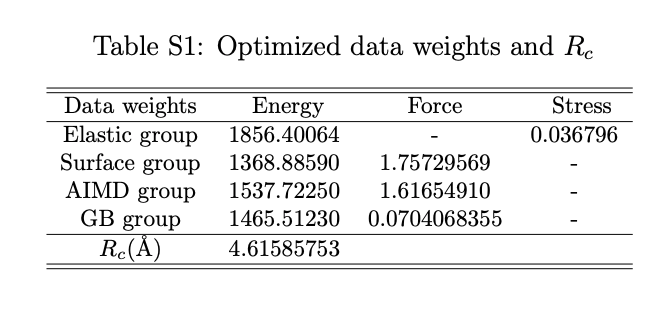

# Using the training data

The training data is provided in json files, which can be read by any standard json parser. Each json file contains contains one data group (e.g., AIMD-NpT, AIMD-NVT, elastic, surfaces, etc.) used in the training of the SNAP model.

The data is provided as a list of dicts. Each dict contains one structure with data. The format of the json file is as follows:

```json
[
    {
        "structure": {"Dict representation of Structure as output by pymatgen"},
        "group": "AIMD-NVT",
        "description": "Snapshot 1 of 40 of AIMD NVT simulation at 300 K",
        "data": {
            "energy_per_atom": -1.24324,
            "forces": [],
            "virial_stress": []
        },
        "optimized parameters": {
            "bispectrum_coefficients": [],
        }
    },
    ...
]
```
Note that the order for stress is `xx, yy, zz, yz, xz, xy` in this data set as in `SNAP` formulism, and the unit is in `kB`, same as in VASP. The raw stress data taken from VASP has the order `xx, yy, zz, xy, yz, xz` and the calculated stress from LAMMPS takes the order `xx, yy, zz, xy, zx, yz`. Please make sure that the order is correct and matches the SNAP feature order `xx, yy, zz, yz, xz, xy`. 

The `bispectrum coefficient` has been averaged by the number of atoms in the structure and the `stress descriptor` has been converted from a unit of `eV/A^3` to `kB` (times 1602.1766). 

To reproduce these results, please use `LAMMPS 17 Nov 2016`. The cutoff radius is `4.61585753 Angstrom` for Mo, with element weight equals to `1`.
The weights for training data groups are as follows:



# Data sources

* Surfaces with Miller indices up to 3.

    ```
    Tran, R.; Xu, Z.; Radhakrishnan, B.; Winston, D.; Sun, W.; Persson, K. A.; Ong, S. P. Surface energies of elemental crystals. Sci. Data 2016, 3, 160080 DOI: 10.1038/sdata.2016.80.
    ```

* (110) Σ3 twist, (111) Σ3 tilt, (110) Σ11 twist, (100) Σ5 twist and (310) Σ5 tilt grain boundaries

    ```
    Tran, R.; Xu, Z.; Zhou, N.; Radhakrishnan, B.; Luo, J.; Ong, S. P. Computational study of metallic dopant segregation and embrittlement at Molybdenum grain boundaries. Acta Mater. 2016, 117, 91–99 DOI: 10.1016/j.actamat.2016.07.005.
    ```
