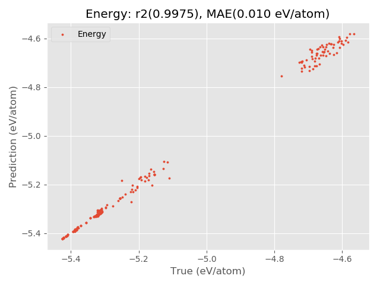

Quick Start
===========
Below is a quick example to quickly make a force field for silicon.

.. code-block:: Python

    from pyxtal_ff import PyXtal_FF
    
    train_data = "../pyxtal_ff/datasets/Si/UCSD/training.json"
    NN_model = {'system': ['Si']}
    trainer = PyXtal_FF(TrainData=train_data, model=NN_model)
    trainer.run()

The script will first compute the descriptors (``Bispectrum`` descriptor is used by default). 
As long as the descritors are obtained, they will be fed to the neural network trainining. 
Below is an example output from this quick script.

::

             ______       _    _          _         _______ _______ 
            (_____ \     \ \  / /        | |       (_______|_______)
             _____) )   _ \ \/ / |_  ____| |        _____   _____   
            |  ____/ | | | )  (|  _)/ _  | |       |  ___) |  ___)  
            | |    | |_| |/ /\ \ |_( ( | | |_______| |     | |      
            |_|     \__  /_/  \_\___)_||_|_(_______)_|     |_|      
                   (____/      
    
    
    ------------------------(version 0.0.1 )----------------------
    
    A Python package for Machine learning of interatomic force field
    The source code is available at https://github.com/qzhu2017/FF-project
    Developed by Zhu's group at University of Nevada Las Vegas
    
    
    The following parameters are used in descriptor calculation
    type        : Bispectrum
    Rc          : 6.0
    derivative  : False
    lmax        : 3
    rfac        : 1.0
    opt         : polynomial

    219 structures have been loaded
    Computing the descriptors -----------
    load the precomputed values from  /anaconda3/lib/python3.6/site-packages/pyxtal_ff-0.0.1-py3.6.egg/pyxtal_ff/descriptors/Wigner_coefficients.npy
     219 out of  219
    Computed descriptors for 219 entries
    Saved the descriptors to  Si-Bispectrum/Train.npy
    
    
    ========================== Training ==========================
    Restart: None
    Runner: numpy
    Batch: 219
    Optimizer: L-BFGS-B
    Jacobian: True
    
    Epoch:    1, Loss:      12.48075033
    Epoch:    2, Loss:       4.74505507
    Epoch:    3, Loss:       0.35717777
    Epoch:    4, Loss:       0.04156070
    Epoch:    5, Loss:       0.04100469
    Epoch:    6, Loss:       0.03971665
    Epoch:    7, Loss:       0.03781257
    ...
    ...
    Epoch:  120, Loss:       0.00012562
    Epoch:  121, Loss:       0.00050947
    Epoch:  122, Loss:       0.00012534
    Epoch:  123, Loss:       0.00012482
    Epoch:  124, Loss:       0.00012826
    Epoch:  125, Loss:       0.00012466
    Epoch:  126, Loss:       0.00012416
    Epoch:  127, Loss:       0.00012378
    The training time: 40.12 s
    ==================== Training is Completed ===================
    ======================== Evaluating ==========================
    Energy R2  : 0.997501
    Energy MAE : 0.009621
    
    Export the figure to: Si-Bispectrum/Train.png
    =================== Evaluation is Completed ==================

After the training is complete, the optimized weight information will be stored as ``Si-Bispectrum/6-6-parameters.json``, where ``6-6`` describes the neuron information. 
In the meantime, the code also provide graphicial output to facilitate the analysis.

If you feel that the quality of results are not satisfactory, you can contine the training from the previous run file (``parameters.json``) with a more customized NN weight ``optimizer``.

.. code-block:: Python

    from pyxtal_ff import PyXtal_FF
    
    train_data = "../pyxtal_ff/datasets/Si/UCSD/training.json"
    NN_model = {'system': ['Si'],
                'restart': 'Si-Bispectrum/6-6-parameters.json',
                'optimizer': {'method': 'L-BFGS-B',
                              'options': {'maxiter': 100},
                             }
               }
    
    #------------------------- Run NN calculation ------------------------------
    trainer = PyXtal_FF(TrainData=train_data,  model=NN_model)
    trainer.run()

::

             ______       _    _          _         _______ _______ 
            (_____ \     \ \  / /        | |       (_______|_______)
             _____) )   _ \ \/ / |_  ____| |        _____   _____   
            |  ____/ | | | )  (|  _)/ _  | |       |  ___) |  ___)  
            | |    | |_| |/ /\ \ |_( ( | | |_______| |     | |      
            |_|     \__  /_/  \_\___)_||_|_(_______)_|     |_|      
                   (____/      
    
    
    ------------------------(version 0.0.1 )----------------------
    
    A Python package for Machine learning of interatomic force field
    The source code is available at https://github.com/qzhu2017/FF-project
    Developed by Zhu's group at University of Nevada Las Vegas
    
    ========================== Training ==========================
    Restart: Si-Bispectrum/6-6-parameters.json
    Runner: numpy
    Batch: 219
    Optimizer: L-BFGS-B
    Jacobian: True
    
    Epoch:    1, Loss:       0.00012378
    Epoch:    2, Loss:       2.29013772
    ...
    ...
    Epoch:  127, Loss:       0.00010031
    Epoch:  128, Loss:       0.00006633
    The training time: 39.69 s
    ==================== Training is Completed ===================
    ======================== Evaluating ==========================
    Energy R2  : 0.998736
    Energy MAE : 0.006759
    
    Export the figure to: Si-Bispectrum/Train.png
    =================== Evaluation is Completed ==================

.. image:: ../../imgs/quick-Energy_Train1.png
   :height: 600 px
   :width: 800 px
   :scale: 43 %

Clearly, the MAE value has a big drop from 10 meV/atom to 7 meV/atom.
