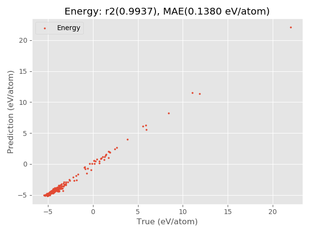

Quick Start
===========
Below is a quick example to quickly make a force field for silicon.

.. code-block:: Python

    from pyxtal_ff import PyXtal_FF
    
    train_data = "pyxtal_ff/datasets/Si/PyXtal/Si8.json"
    descriptors = {'type': 'SOAP',
                   'Rc': 5.0,
                   'parameters': {'lmax': 4, 'nmax': 3},
                   'N_train': 400,
                  }
    model = {'system': ['Si'],
             'hiddenlayers': [16, 16],
            }
    ff = PyXtal_FF(descriptors=descriptors, model=model)
    ff.run(mode='train', TrainData=train_data)

The script will first compute the ``SOAP`` descriptor . 
As long as the descritors are obtained, they will be fed to the neural network trainining. 
Below is an example output from this quick script.

::

                 ______       _    _          _         _______ _______ 
                (_____ \     \ \  / /        | |       (_______|_______)
                 _____) )   _ \ \/ / |_  ____| |        _____   _____   
                |  ____/ | | | )  (|  _)/ _  | |       |  ___) |  ___)  
                | |    | |_| |/ /\ \ |_( ( | | |_______| |     | |      
                |_|     \__  /_/  \_\___)_||_|_(_______)_|     |_|      
                       (____/      
        
        
    
    ================================= version 0.0.9 =================================
    
    Descriptor parameters:
    type        : SOAP
    Rc          : 5.0
    nmax        : 3
    lmax        : 4
    
    
    2012 structures have been loaded.
    Computing the descriptors...
     400 out of  400
    Saving descriptor-feature data to Si-SOAP/Train_db.dat
    
    ==================================== Training ====================================
    
    No of structures   : 400
    No of descriptors  : 30
    No of parameters   : 785
    No of epochs       : 1
    Optimizer          : lbfgs
    Force_coefficient  : 0.03
    Stress_coefficient : None
    Batch_size         : None
    
    Iteration   99: 
    eng_loss:   0.020505     force_loss:   0.022794   stress_loss:   0.000000  regularization:   0.000000
        Loss:   0.043299     Energy MAE:     0.1383     Force MAE:     0.2759     Stress MAE:     0.0000
    
    Iteration  100: 
    eng_loss:   0.020105     force_loss:   0.022543   stress_loss:   0.000000  regularization:   0.000000
        Loss:   0.042649     Energy MAE:     0.1380     Force MAE:     0.2756     Stress MAE:     0.0000
    
    The training time: 116.85 s
    The Neural Network Potential is exported to Si-SOAP/16-16-checkpoint.pth
    
    
    ============================= Evaluating Training Set ============================
    
    The results for energy: 
        Energy R2     0.993670
        Energy MAE    0.138006
        Energy RMSE   0.200526
    The energy figure is exported to: Si-SOAP/Energy_Train.png
    
    
    The results for force: 
        Force R2      0.880971
        Force MAE     0.275650
        Force RMSE    0.707787
    The force figure is exported to: Si-SOAP/Force_Train.png

After the training is complete, the optimized weight information will be stored as ``Si-SOAP/16-16-checkpoint.pth``, where ``16-16`` describes the neuron information. 
In the meantime, the code also provide graphicial output to facilitate the analysis.

If you feel that the quality of results are not satisfactory, you can contine the training from the previous run file (``Si-SOAP/16-16-checkpoint.pth``) with the ``restart`` option.

.. code-block:: Python

    from pyxtal_ff import PyXtal_FF
    
    train_data = "pyxtal_ff/datasets/Si/PyXtal/Si8.json"
    descriptors = {'type': 'SOAP',
                   'Rc': 5.0,
                   'parameters': {'lmax': 4, 'nmax': 3},
                   'N_train': 400,
                  }
    model = {'system': ['Si'],
             'hiddenlayers': [16, 16],
             'restart': 'Si-SOAP/16-16-checkpoint.pth',
            }
    ff = PyXtal_FF(descriptors=descriptors, model=model)
    ff.run(mode='train', TrainData=train_data)

::

    The results for energy: 
        Energy R2     0.997013
        Energy MAE    0.093162
        Energy RMSE   0.137752
    The energy figure is exported to: Si-SOAP/Energy_Train.png
    
    
    The results for force: 
        Force R2      0.951379
        Force MAE     0.200881
        Force RMSE    0.452365
    The force figure is exported to: Si-SOAP/Force_Train.png
    
Clearly, running another 100 training steps notably reduces the MAE values.
Thereforce, we can continue to train it by specifying the ``epoch`` option.

.. code-block:: Python

    from pyxtal_ff import PyXtal_FF
    
    train_data = "pyxtal_ff/datasets/Si/PyXtal/Si8.json"
    descriptors = {'type': 'SOAP',
                   'Rc': 5.0,
                   'parameters': {'lmax': 4, 'nmax': 3},
                   'N_train': 400,
                  }
    model = {'system': ['Si'],
             'hiddenlayers': [16, 16],
             'restart': 'Si-SOAP/16-16-checkpoint.pth',
             'epoch': 600,
            }
    ff = PyXtal_FF(descriptors=descriptors, model=model)
    ff.run(mode='train', TrainData=train_data)

Below are the results after 1000 steps of training.

.. image:: ../../imgs/quick-Energy_Train2.png
   :height: 600 px
   :width: 800 px
   :scale: 43 %

